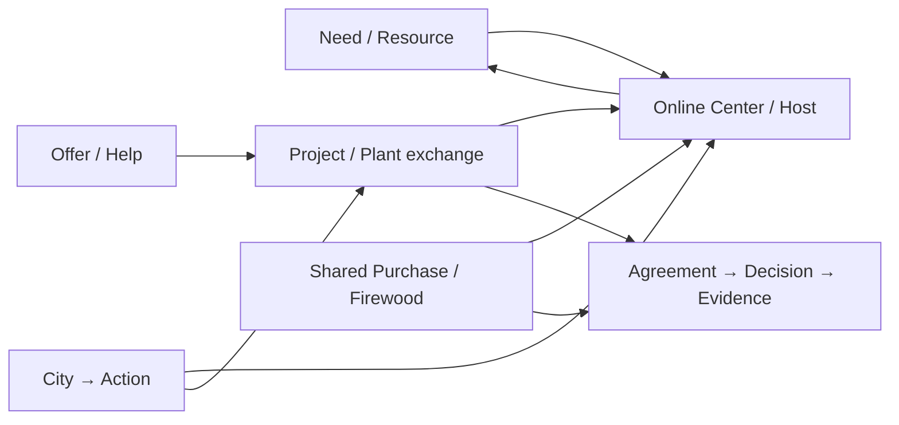

# Mura Whole-System Story Map v1

Date: 4 October 2026.  
Status: **architecture/experience map; not a claim that all stories are shipped**.  
Authority: `FOUNDATION_CHARTER.md` / FK-FOUNDATION-2026-10-04.

## Purpose

Mura should explain the integrated FOLKOOP through a small number of connected life stories rather than a catalogue of features. These stories are optional and cross-linked. They are not one giant mandatory tutorial.

The whole-system story goal is:

`intent → people/resources → coordination → action → outcome → repeat / next useful action`

Each story explicitly separates what exists now from what is only illustrative or approved target work. Mura must never make future capabilities, a physical venue, real forum integration, verified outcome or blockchain transaction look live when it is not.

## Global story rules

- Stories are optional and cross-linked; they must not become one enormous mandatory tour.
- Mura stays read-only and does not mutate real account/network state.
- Mura and her circle are authored illustrative data.
- System/privacy/source facts remain system voice rather than Mura pretending to be policy documentation.
- Shipped, illustrative and target steps must be visibly distinguishable.
- No signup pressure appears until explicit Mura exit.
- Every implemented user-facing cluster eventually needs at least one linked Mura story and one real-user acceptance scenario.
- A story may use truthful official City sources while the personal narrative around them remains illustrative.

## Online Center v0 contract alignment

Before Online Center Göteborg v0, `MURA_ACCEPTANCE_CONTRACT.md` hid Center in Mura navigation.

Foundation Charter §9 requires Mura to include Center and the Göteborg local-community context as that slice becomes available.

The v0 slice now aligns runtime and acceptance: Mura can open an authored read-only Center story and real users get connected self-service routes. Staffed Host/referral operation, live forum synchronization and physical venue claims remain explicitly unimplemented.

## Seven canonical stories

### mura-01-need-resource-return — A concrete Need becomes a useful borrowed resource

**Status:** `current_partial`  
**Question:** I need a tool for one real task. Can FOLKOOP connect the need to a person/resource and show what happened next?

**Entry points:** `home`, `together`, `people`, `messages`, `me`  
**Domain objects:** `person`, `intent`, `need`, `resource_cooperation`, `resource`, `conversation`, `outcome`, `evidence_artifact`  
**Requirements:** `FN-08`, `KP-02`, `FX-06`, `W34-14`, `MU-01`, `MU-04`

Current fixture/evidence:
- apps/web/network-ui.js: open illustrative Need 'Borrow a tile cutter for the weekend'
- apps/web/network-ui.js: completed illustrative Need 'Borrowed a folding ladder'

Current gap: **The fixture shows an open tool need and a separate completed borrowing story, but not yet one continuous Need → matched Resource/Person → coordination → independently classified Outcome chain.**

Story path:

| Stage | Status | What the visitor should understand |
|---|---|---|
| `intent` | `current_illustrative` | Mura has a concrete short-lived tool need. |
| `publish_need` | `current_illustrative` | The need exists as a Need cooperation object with place/context. |
| `match_resource_person` | `target_connection` | Show the relevant resource and the person/steward who can make the next step possible. |
| `coordinate` | `current_capability_target_story` | Use the linked work chat/updates where membership permits; do not invent a chat if the fixture does not contain one. |
| `real_action` | `illustrative_narrative` | Tool is borrowed and returned outside the app. |
| `outcome` | `target_first_class` | Represent the useful result separately from cooperation status and attach evidence/confirmation level. |

Truth boundaries:
- A current done status is not a confirmed real-world Outcome.
- The visitor must understand that Mura and the lender are authored illustrative people.
- No real inventory availability is implied.

Acceptance questions:
- Visitor can explain why a Need is more useful than an unstructured post.
- Visitor can follow the story from need to person/resource to coordination.
- Visitor can distinguish a completed UI state from confirmed real-world outcome evidence.

Cross-links: `mura-06-online-center-host`, `mura-07-agreement-decision-evidence`.

### mura-02-offer-help-repair-outcome — An Offer becomes useful help in another person's project

**Status:** `current_partial`  
**Question:** I can help with photography. How does that become useful work instead of a profile claim?

**Entry points:** `me`, `together`, `projects`, `people`, `communities`  
**Domain objects:** `person`, `skill`, `offer`, `project`, `project_task`, `community`, `conversation`, `outcome`, `evidence_artifact`  
**Requirements:** `FN-08`, `KP-02`, `FN-09`, `FX-06`, `MU-01`, `MU-04`

Current fixture/evidence:
- apps/web/network-ui.js: Mura Offer 'I can help with photography'
- apps/web/network-ui.js: completed 'Repair café afternoon'
- apps/web/network-ui.js: completed 'Photographed the repair café'
- apps/web/network-ui.js: completed repair-café photography task

Current gap: **The ingredients exist and completed states are visible, but the UI does not yet expose a first-class Outcome/evidence chain tying the Offer to the project result.**

Story path:

| Stage | Status | What the visitor should understand |
|---|---|---|
| `offer` | `current_illustrative` | Mura exposes a concrete photography Offer. |
| `match_project` | `current_illustrative_partial_link` | A neighbourhood repair project needs useful contribution. |
| `task` | `current_illustrative` | Photography becomes a concrete project task rather than a generic profile skill. |
| `action` | `current_illustrative` | The task is completed and project narrative records real-world work. |
| `outcome` | `target_first_class` | Future story links contribution to an Outcome with confirmation/evidence level. |

Truth boundaries:
- Completed fixture text is an authored story, not evidence about real participants.
- Skill text and Offer are not credentials or proof of competence.
- No public photo-consent claim is implied by completing a photography task.

Acceptance questions:
- Visitor can explain the difference between having a skill and contributing it to a real project.
- Visitor can navigate Offer → Project → Task without treating people as followers.
- Visitor understands that outcome evidence needs a separate confirmation layer.

Cross-links: `mura-03-project-plant-exchange`, `mura-06-online-center-host`.

### mura-03-project-plant-exchange — A small idea grows into a project with people, tasks and a work chat

**Status:** `current_slice`  
**Question:** I have a small local idea. How does it gain people and next actions without disappearing in a feed?

**Entry points:** `home`, `projects`, `people`, `messages`, `communities`  
**Domain objects:** `project`, `project_task`, `person`, `community`, `conversation`, `activity`, `outcome`  
**Requirements:** `FN-09`, `FN-11`, `FX-01`, `GBG-03`, `MU-01`, `MU-04`

Current fixture/evidence:
- apps/web/network-ui.js: active illustrative Project 'Plant and seed exchange'
- apps/web/network-ui.js: project tasks, updates, participants and linked work chat
- apps/web/network-ui.js: completed 'Prepare a small sign' task

Current gap: **The project workspace exists, but the story is active rather than independently outcome-classified and is not yet linked to Center/Activity as a first-class object.**

Story path:

| Stage | Status | What the visitor should understand |
|---|---|---|
| `idea` | `current_illustrative` | Mura starts with a concrete neighbourhood exchange idea. |
| `project` | `current_illustrative` | The idea becomes a Project with stated purpose. |
| `people` | `current_illustrative` | Specific people are connected because of roles/contributions, not follower count. |
| `tasks_chat_updates` | `current_illustrative` | Tasks, updates and work chat turn the idea into coordinated next actions. |
| `activity_place` | `target_connection` | Future Center/Activity/Place objects make the real gathering and partner location explicit. |
| `outcome_repeat` | `target_first_class` | Record the event outcome and whether participants continue into another cooperation. |

Truth boundaries:
- A Project card is not 'launched' merely because it exists.
- Physical venue availability must not be invented.
- Participant-led activity does not imply a formal legal organisation.

Acceptance questions:
- Visitor can follow Project → Person → Task → Chat/Update.
- Visitor can identify the next unfinished task.
- Visitor understands that a real gathering/outcome happens outside the coordination UI.

Cross-links: `mura-02-offer-help-repair-outcome`, `mura-06-online-center-host`, `mura-07-agreement-decision-evidence`.

### mura-04-shared-purchase-firewood — A group purchase coordinates demand, supplier terms and pickup without pretending to be checkout

**Status:** `current_slice`  
**Question:** Several people need the same thing. Can they coordinate quantities, supplier terms and pickup without FOLKOOP pretending to hold money or place the legal order?

**Entry points:** `home`, `together`, `messages`, `people`  
**Domain objects:** `shared_purchase`, `purchase_commitment`, `supplier_offer`, `supplier_offer_choice`, `purchase_process`, `purchase_confirmation`, `conversation`, `economic_coordination`, `outcome`  
**Requirements:** `KP-03`, `KP-04`, `KP-05`, `KP-06`, `IN-02`, `MU-01`, `MU-04`

Current fixture/evidence:
- apps/web/network-ui.js: active illustrative Shared Purchase 'Dry firewood together'
- apps/web/network-ui.js: purchase confirmation state and Omar logistics relationship
- current DB: purchase commitments/offers/choice/process/confirmations

Current gap: **The shared-purchase slice is implemented, but the broader preserved economic cycle—production, sales, storage, logistics/returns and specialist accounting/payment integrations—is not complete.**

Story path:

| Stage | Status | What the visitor should understand |
|---|---|---|
| `aggregate_demand` | `current_illustrative` | Participants state quantities for a shared purchase. |
| `supplier_coordination` | `current_capability` | Supplier offers can be compared and one can be selected as a coordination preference. |
| `confirmation` | `current_illustrative` | Participants confirm/decline frozen quantities before external order. |
| `external_order` | `current_capability` | Organizer records that an order was placed outside FOLKOOP; FOLKOOP does not send or verify the order. |
| `delivery_pickup` | `current_capability` | Delivery/pickup and participant collection can be coordinated. |
| `outcome_economy` | `target_connection` | Outcome/evidence and the wider production/sale/logistics cycle remain future slices. |

Truth boundaries:
- No checkout, escrow, payment custody or binding supplier order is created by current FOLKOOP.
- Organizer delivery/order notes are self-reported unless separately evidenced.
- Price/offer data does not certify supplier identity or qualification.

Acceptance questions:
- Visitor can explain the difference between coordination and payment/order execution.
- Visitor can see why frozen confirmation exists before an external order marker.
- Visitor can identify the path from group demand to pickup and a later Outcome.

Cross-links: `mura-06-online-center-host`, `mura-07-agreement-decision-evidence`.

### mura-05-city-to-action — An official City question leads to a human or cooperative next step

**Status:** `current_v0_partial`  
**Question:** I have a city question or problem. Can I find the authoritative route and then connect it to people/resources/projects without FOLKOOP pretending to be the authority?

**Entry points:** `city`, `home`, `projects`, `together`  
**Domain objects:** `civic_feed`, `civic_item`, `source_provenance`, `city_process`, `organisation`, `service`, `need`, `project`, `center`, `outcome`  
**Requirements:** `SV-01`, `SV-02`, `SV-03`, `SV-04`, `SV-05`, `SV-10`, `SV-12`, `FO-04`, `IN-01`, `FN-02`, `MU-03`

Current fixture/evidence:
- `docs/DATA_MODEL.md`: source-first CivicFeedEnvelope/CivicItem
- `apps/web/app.js`: Göteborg City routing and official-source handoffs
- `apps/web/app.js` + `apps/web/folkoop.js`: explicit same-origin source-context handoff to Online Center v0 for normalized Göteborg open plans and Riksdagen documents
- Mura City mode may read truthful public/official sources

Current gap: **City → FOLKOOP v0 now carries a bounded, allowlisted official source context into Online Center and exposes current People/Communities/Together/Projects routes. It does not persist a first-class City Process, auto-create cooperation, bridge NVDB/report drafts yet, or preserve the source as a stored relation after a later cooperation is created.**

Story path:

| Stage | Status | What the visitor should understand |
|---|---|---|
| `question` | `current_runtime` | Mura starts from a concrete city question, not an agency name. |
| `source_route` | `current_runtime` | FOLKOOP shows source/provenance and the authoritative route/responsible actor when available. |
| `choose_next_step` | `current_v0` | For normalized Göteborg open plans and Riksdagen documents, the user may explicitly continue into Online Center while retaining the official source link, then choose Communities, People, Together or Projects. |
| `coordinate` | `current_v0_navigation` | The source context stays visible in the in-memory Center handoff card while the user chooses an existing cooperative route; no cooperation is auto-created and the context is not yet persisted into a first-class City Process relation. |
| `outcome` | `target_first_class` | Record whether the official/community/project next step was actually useful. |

Truth boundaries:
- source != claim; fetched/derived data must remain distinguishable from an authority decision.
- FOLKOOP must not claim that an official report was submitted unless the official system confirms it.
- The bridge never auto-publishes a Need/Project or submits an official case.
- Mura may use real public source data, but her personal story around it remains illustrative.

Acceptance questions:
- Visitor can identify and reopen the original official source after entering FOLKOOP.
- Visitor can distinguish FOLKOOP guidance from public authority.
- Visitor can choose at least two cooperative next-action routes without an automatic post/project being created.
- Mura can use the same bridge read-only without turning public source data into a claim about her real activity.

Cross-links: `mura-03-project-plant-exchange`, `mura-06-online-center-host`.

### mura-06-online-center-host — Online Center Göteborg connects ordinary community life, Host navigation and city/partner opportunities

**Status:** `current_v0_partial`  
**Question:** I arrive with a vague question or simply want local community. Can I enter an online/hybrid Center, talk normally, and get a useful human next step without being forced into a task workflow?

**Entry points:** `center`, `communities`, `people`, `city`, `home`  
**Domain objects:** `center`, `host`, `referral`, `community`, `person`, `service`, `organisation`, `place`, `activity`, `need`, `offer`, `project`, `outcome`  
**Requirements:** `FN-01`, `FN-02`, `FN-03`, `FN-04`, `FN-05`, `FN-06`, `FN-07`, `FN-10`, `FN-11`, `GBG-01`, `GBG-02`, `GBG-03`, `GBG-04`, `GBG-05`, `GBG-06`, `GBG-07`, `GBG-08`, `IN-04`, `MU-03`

Current fixture/evidence:
- `apps/web/folkoop.js`: Online Center Göteborg v0 connects People, Communities, City, Together and Projects
- `apps/web/folkoop.js`: Mura can open Center under the City context
- `apps/web/folkoop-copy.js`: Göteborg external-community context is labelled as non-synchronized
- Box Center master spec: Host flow Welcome → Consent → Need → Match → Handoff → Follow-up
- Box Göteborg forum source preserves ordinary topical conversation, peer support, moderators, meetings/services/exchange

Current gap: **Online Center v0 now provides connected self-service routes and an authored Mura Göteborg context. Staffed Host consent/clarification, warm referral/follow-up, live forum synchronization, first-class Center/Place/Activity objects and any physical venue remain unimplemented.**

Story path:

| Stage | Status | What the visitor should understand |
|---|---|---|
| `local_context` | `current_v0` | Selected Göteborg context can expose the local Center surface; another city does not receive fabricated Göteborg community context. |
| `ordinary_community` | `current_v0_illustrative` | Mura shows authored local-community context; signed-in Göteborg users may open the external community through a plain outbound link with no data synchronization. |
| `consent` | `target_human_operation` | A future staffed Host asks whether the person wants navigation/help before matching. |
| `clarify` | `target_human_operation` | A future Host clarifies the person's question/need without profiling by appearance/background. |
| `route` | `current_v0_self_service` | Center offers current routes to People, Communities, City, Together and Projects; it does not pretend a human referral occurred. |
| `handoff` | `target_human_operation` | Future warm referral has a concrete next step and preserves source/provider identity. |
| `follow_up` | `target_human_operation` | Future follow-up asks whether the referral/connection was used/useful without surveillance. |

Truth boundaries:
- Do not claim a physical Center venue is open.
- Do not claim a live Telegram/forum integration exists.
- Do not import/copy/link real forum members, identities or messages without separate authorization.
- Use authored illustrative people/messages for Mura's local Center story.
- No contact sharing without consent and no unsolicited matching pressure.
- Ordinary community conversation remains valid; FOLKOOP must not force every interaction into a Need/Project.

Acceptance questions:
- Visitor can explain what an online/hybrid Center adds beyond a forum and beyond a directory.
- Visitor can move from Center to People, Communities, City, Together or Projects without encountering a fake Host workflow.
- Visitor understands that staffed Host/referral/follow-up is not operating in v0.
- Göteborg visitor can distinguish the external local-community link from FOLKOOP-synchronized data.
- Mura visitor understands that local people/messages are authored illustration rather than copied forum content.

Cross-links: `mura-01-need-resource-return`, `mura-03-project-plant-exchange`, `mura-05-city-to-action`.

### mura-07-agreement-decision-evidence — A shared decision becomes an authorised action with evidence and an independently checkable integrity anchor

**Status:** `approved_target_future_prototype`  
**Question:** When several people or organisations make a consequential shared decision, can FOLKOOP show what version was agreed, who had authority, what action followed and what evidence exists—without putting personal data on a blockchain?

**Entry points:** `projects`, `communities`, `center`  
**Domain objects:** `agreement`, `decision_record`, `project`, `outcome`, `evidence_artifact`, `attestation`, `passport_credential`, `node`  
**SDCF concepts:** `decision_semantic`, `plan`, `controlled_action`, `claim_evidence`  
**Requirements:** `KP-07`, `KP-08`, `SDCF-07`, `SDCF-08`, `SDCF-09`, `SDCF-12`, `BC-01`, `BC-02`, `BC-03`, `BC-04`, `BC-05`, `BC-06`, `BC-07`, `BC-08`, `W34-18`

Current fixture/evidence:
- docs/FOUNDATION_CHARTER.md: blockchain required as a scoped workstream
- docs/architecture/SDCF_INTEGRATION.md: decision/plan/action/evidence distinctions
- docs/architecture/TRUST_IDENTITY_WEB4_ARCHITECTURE.md: operational DB remains source of truth

Current gap: **No Agreement/Decision/Outcome/Attestation first-class runtime and no blockchain testnet proof are shipped.**

Story path:

| Stage | Status | What the visitor should understand |
|---|---|---|
| `alternatives` | `target` | People see the objective, constraints and alternatives before a consequential group decision. |
| `decision_authority` | `target` | Record selected alternative, purpose, authority/participants and version. |
| `agreement_version` | `target` | Store the actual agreement/decision document off-chain with explicit versioning. |
| `plan_action` | `target` | Trace a plan and authorised controlled action back to the decision. |
| `outcome_evidence` | `target` | Separate participant claims, multi-party confirmations and external evidence. |
| `testnet_anchor` | `future_prototype` | Anchor only an appropriately designed commitment/hash in a real testnet transaction and independently verify it. |
| `correction_revocation` | `future_prototype` | Corrections/revocations create new traceable state; immutable anchor does not make an incorrect claim true. |

Truth boundaries:
- No profile, private message, home address, forum membership or sensitive request goes onto a public immutable ledger.
- Hashing alone is not assumed to anonymise personal data.
- No simulated receipt may be presented as an actual blockchain transaction.
- No mandatory wallet, seed phrase, token, NFT or crypto payment for ordinary users.
- Blockchain integrity does not prove real-world truth, valid authority or legal validity.

Acceptance questions:
- Visitor can distinguish Agreement, Decision, Action, Outcome, Evidence and Integrity Anchor.
- A specialist can independently verify the testnet anchor from public chain data when the prototype exists.
- Ordinary FOLKOOP use remains available when the chain is unavailable.

Cross-links: `mura-03-project-plant-exchange`, `mura-04-shared-purchase-firewood`.

## Cross-story system view

The purpose of these links is not to force a visitor through every story. It is to make FOLKOOP feel like one life/system: the same people, communities, resources, city context, projects and outcomes can reappear from different entry points.

## Story-specific architectural decisions

### Need/Offer are not content-feed primitives

A Need or Offer should lead toward a person/resource/next action. The current fixture already contains open and completed cooperation examples, but future Outcome semantics must remain separate from a `done` status.

### Projects need real-world endings

The plant-exchange story already has people, tasks, updates and a work chat. The next architecture step is not more cards; it is explicit Activity/Place/Outcome connection when those domain slices exist.

### Shared Purchase is coordination, not checkout

The firewood story demonstrates a valuable current economic slice. Mura must preserve the distinction between quantity/supplier/logistics coordination and payment, legal ordering or supplier verification.

### City stays authoritative-source-first

Mura can use real official City data. A future City → Cooperation bridge must keep source/provenance and official responsibility visible while allowing a user to move into People, Center, Need or Project when that is the useful next step.

### Online Center must feel like ordinary community plus useful navigation

The Göteborg Center story must include authored local community context, normal conversation, human Host consent, a small number of useful options and follow-up. It must not copy real forum conversations or imply a live external integration. Not every conversation should be forced into a task object.

### Blockchain appears only after Agreement/Decision/Evidence semantics

Mura should not show a blockchain badge first. The story begins with a real trust problem: what was agreed, which version, who had authority, what action followed, and what evidence exists. A later testnet anchor is meaningful only if it adds independent verification beyond simpler mechanisms.

## Implementation sequencing

1. Keep the current Mura fixture stable while the architecture maps are validated.
2. First new story implementation: **Online Center Göteborg / Host**; update the old Center-hidden acceptance rule in the same runtime PR, not beforehand.
3. Then connect **City → Cooperation next action**.
4. Deepen **cooperative economy** beyond the current Shared Purchase slice only when its domain objects/permissions are explicit.
5. Add first-class **Outcome/Evidence/Attestation** semantics before presenting verified completion or blockchain proof.
6. Build the **Agreement/Decision/Attestation + blockchain testnet proof** only after the underlying off-chain semantics exist.

Machine-readable source: `docs/mura-whole-system-story-map-v1.json`.
