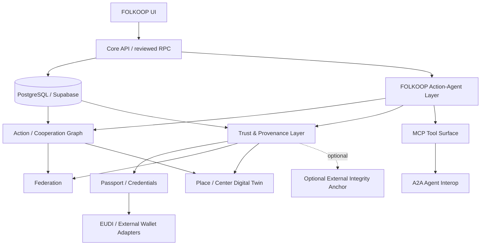
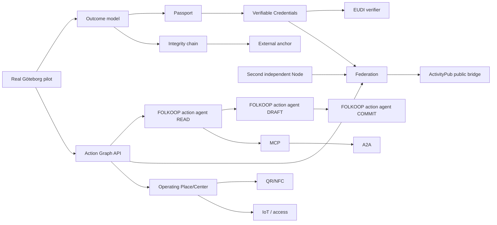

# FOLKOOP Trust, Identity & Web4 Architecture v0.1

1 October 2026.

## Status and authority

Status: **approved future architecture direction; non-runtime**.

This document defines how FOLKOOP may adopt selected Web3 and Web4 capabilities without turning the product into a crypto-first application and without delaying the protected Göteborg core-loop pilot.

It is subordinate to:

- `docs/PRODUCT_CONCEPT.md`;
- `docs/PRODUCT_DECISION_POLICY.md`;
- `docs/GOTEBORG_CORE_LOOP_PILOT.md`;
- current privacy/security policy;
- `docs/architecture/OUTCOME_INTEGRITY.md`.

The durable decision is recorded in:

- `docs/architecture/adr/ADR-001-web3-web4-direction.md`.

The implementation sequence is recorded in:

- `docs/architecture/WEB3_WEB4_ROADMAP.md`.

Nothing in this document authorizes immediate runtime implementation before the product decision gate allows it.

---

# 1. Decision in one paragraph

FOLKOOP remains a normal web application with PostgreSQL/Supabase as its operational source of truth. It may adopt Web3-derived mechanisms where they solve a concrete trust, identity, portability or multi-organisation interoperability problem: verifiable credentials, selective disclosure, cryptographic attestations, federation and optional external integrity anchoring. It may adopt Web4-derived mechanisms where they connect the cooperation graph to intelligent agents and the physical world: FOLKOOP action-agent tools, MCP/A2A interoperability, Places, Resources, QR/NFC, digital-twin state and later IoT/access systems. No crypto wallet, token, NFT, blockchain, graph database or AI model becomes a mandatory participant dependency by default.

---

# 2. Current baseline

At the time of this document:

- FOLKOOP is in pre-pilot execution;
- the public application is on the v0.37 line;
- operational data live in PostgreSQL/Supabase;
- browser writes go through reviewed RPCs and database authorization;
- application tables use RLS;
- Google OAuth remains gated until real-provider verification;
- the FOLKOOP guide is deterministic/non-AI;
- Center is a future physical/community layer, not an operating venue;
- the current protected pilot loop is:
  `Need/Offer -> discovery -> join -> coordination -> real action -> participant-confirmed outcome -> repeat`;
- the current integrity contract already enforces the semantic rule:
  `done != confirmed real-world outcome`.

This architecture must extend that foundation rather than replace it.

---

# 3. Architectural principles

## P1. Cooperation graph first

The primary FOLKOOP asset remains the cooperation graph:

`person -> skill -> intent -> need/offer -> resource -> community -> project -> place -> action -> outcome`.

Web3/Web4 mechanisms are supporting infrastructure around that graph.

## P2. PostgreSQL remains operational truth

Do not replace Supabase/PostgreSQL with a blockchain, graph database, RDF store or peer-to-peer database merely for architectural novelty.

A future semantic/export layer may be derived from relational truth.

## P3. No mandatory crypto UX

Ordinary participants should not need:

- seed phrases;
- browser crypto extensions;
- gas;
- cryptocurrency;
- NFTs;
- DIDs;
- blockchain knowledge.

If cryptographic infrastructure exists, it should normally remain below the product surface.

## P4. Verification proportional to action

Verification strength should match risk.

Examples:

- reading public City data: no account may be required;
- ordinary community participation: normal account;
- 18+ night access: age-over-threshold proof;
- machine access: role/training/access entitlement;
- money/KYC: external regulated provider;
- formal civic eligibility: authoritative public system.

## P5. Minimise personal data

Prefer proofs of required properties over collection of underlying identity data.

Example:

`age_over_18 = true`

is preferable to storing a complete identity document when FOLKOOP only needs age eligibility.

## P6. Outcome evidence is typed, not flattened

Never collapse:

- UI state;
- participant statement;
- multi-party confirmation;
- external evidence;
- cryptographic integrity;
- authority decision

into one generic "verified" flag.

## P7. Human approval for consequential actions

AI may read, recommend and prepare. Consequential actions require explicit authorization according to risk.

## P8. Open standards through adapters

Internal FOLKOOP semantics should remain stable while external protocols are adapters.

This is especially important because standards and ecosystems evolve at different speeds.

## P9. Federation before global centralisation

If independent FOLKOOP Nodes appear, interoperability should not require a single organisation to own every participant's entire history.

## P10. Göteborg pilot is not delayed

No Web3/Web4 feature is a precondition for the first human core-loop pilot unless it fixes a demonstrated safety/privacy defect.

---

# 4. Target layered architecture



Participant-facing product flow remains simple:

`Intent -> Match -> Commit -> Coordinate -> Act -> Outcome -> Repeat`.

The deeper architecture should not leak into ordinary UX.

---

# 5. Stable object identity

Every first-class FOLKOOP object should eventually have a stable globally unique identifier independent of display names.

Preferred internal form:

```text
urn:folkoop:person:<uuid>
urn:folkoop:cooperation:<uuid>
urn:folkoop:project:<uuid>
urn:folkoop:community:<uuid>
urn:folkoop:resource:<uuid>
urn:folkoop:place:<uuid>
urn:folkoop:outcome:<uuid>
urn:folkoop:node:<uuid>
```

Rules:

1. UUID remains the database identity.
2. URN is a portable representation, not a second database identity.
3. URLs may resolve to an object but are not the canonical identity.
4. Imported objects retain origin Node + remote identifier.
5. Human-readable slugs remain mutable presentation data.

---

# 6. Action Graph without a new graph database

The first Action Graph implementation should be a **derived graph over relational data**.

Do not introduce a generic EAV graph table as the first step.

Create a versioned database/API view such as:

`v_action_graph_edges_v1`

Conceptual rows:

| subject | predicate | object | scope | provenance |
|---|---|---|---|---|
| person A | has_skill | skill X | profile | self_asserted |
| person A | member_of | community C | network | server_recorded |
| person A | participates_in | project P | project | server_recorded |
| project P | needs_skill | skill X | project | owner_asserted |
| cooperation C | produced | outcome O | outcome | participant_confirmed |
| resource R | located_at | place L | place | steward_asserted |

The view can be generated from existing normalized tables and later additions.

Benefits:

- FOLKOOP action agent obtains a common query model;
- export/federation has stable vocabulary;
- no duplication of operational truth;
- no premature Neo4j/RDF runtime dependency.

A later RDF/JSON-LD export is permitted only when interoperability justifies it.

---

# 7. Proposed post-pilot Outcome model

These are **candidate future tables**, not approved migrations.

## 7.1 `fk_outcomes`

Purpose: represent the claimed real-world result separately from cooperation state.

Candidate columns:

```text
id uuid primary key
cooperation_id uuid
outcome_type text
summary text
occurred_at timestamptz null
created_by uuid
created_at timestamptz
classification text
schema_version integer
```

Candidate `classification` values:

- `self_reported`
- `confirmed`
- `not_completed`
- `unclear`

These must remain aligned with `OUTCOME_INTEGRITY.md`.

## 7.2 `fk_outcome_confirmations`

```text
id uuid primary key
outcome_id uuid
participant_id uuid
position text
statement_version integer
confirmed_at timestamptz
withdrawn_at timestamptz null
```

A confirmation is a participant statement, not external verification.

## 7.3 `fk_evidence_artifacts`

Store metadata/provenance, not automatically the raw artifact.

```text
id uuid primary key
outcome_id uuid
evidence_type text
source_uri text null
content_hash text null
media_storage_ref text null
issuer_ref text null
created_at timestamptz
retention_class text
```

Examples:

- participant statement;
- external receipt reference;
- authoritative source URL;
- credential;
- document hash.

## 7.4 `fk_provenance_events`

Append-only logical audit journal for epistemically important events.

```text
id uuid primary key
subject_type text
subject_id uuid
event_type text
actor_type text
actor_id text
method text
method_version text
basis jsonb
recorded_at timestamptz
canonical_hash text null
previous_hash text null
```

This journal must not be presented as proof that an external real-world event occurred.

---

# 8. Contextual trust instead of social score

FOLKOOP should not create one scalar reputation value.

Trust evidence should remain contextual.

Examples:

```text
confirmed_cooperations: 12
resource_returns: 8
hosted_activities: 4
active_credentials:
  - FOLKOOP Host
  - Safety onboarding
```

Possible future query:

`get_trust_context(subject, purpose)`

Examples of `purpose`:

- `borrow_resource`
- `host_activity`
- `night_access`
- `project_finance_role`

The response should contain evidence and provenance, not "trustworthiness = 93".

---

# 9. Cryptographic integrity layer

The first integrity implementation should not require blockchain.

## 9.1 Canonical event

For an integrity-relevant event, construct a deterministic canonical representation:

```json
{
  "schemaVersion": 1,
  "eventId": "uuid",
  "eventType": "OutcomeConfirmed",
  "subject": "urn:folkoop:outcome:uuid",
  "recordedAt": "RFC3339 timestamp",
  "evidenceClass": "participant_confirmed"
}
```

Rules:

- exclude mutable presentation fields;
- exclude unnecessary personal data;
- canonicalize deterministically;
- hash with a modern approved hash function;
- version the canonicalization method.

## 9.2 Hash chain

Candidate fields:

```text
canonical_hash
previous_hash
hash_method
canonicalization_version
```

This makes accidental or partial tampering detectable.

It does **not** independently protect against a fully privileged operator rewriting the entire database and recomputing the chain.

## 9.3 Merkle batches

A future daily/hourly batch may combine event hashes into a Merkle root.

Candidate tables:

### `fk_integrity_batches`

```text
id uuid
from_event_id uuid
to_event_id uuid
leaf_count integer
merkle_root text
created_at timestamptz
algorithm text
```

### `fk_integrity_anchors`

```text
id uuid
batch_id uuid
provider text
external_reference text
anchored_at timestamptz
status text
verification_metadata jsonb
```

Provider interface:

```text
IntegrityAnchorProvider
  no_anchor
  trusted_timestamp
  ebsi_or_european_trust_adapter
  public_ledger_adapter
```

The provider must be replaceable.

## 9.4 No personal data on public ledgers

Do not write:

- names;
- email addresses;
- user UUIDs that are publicly linkable;
- messages;
- precise addresses;
- photographs;
- sensitive attributes;
- full credentials

to a public immutable ledger.

Only non-reversible integrity commitments should be considered, and only after privacy review.

---

# 10. FOLKOOP Passport

Passport is a participant-facing **view over multiple claim classes**, not a universal identity database.

Claim classes:

1. `self_asserted`
2. `folkoop_recorded`
3. `folkoop_attested`
4. `external_credential`
5. `external_authoritative`

Example:

```text
Pavel
Göteborg

Self asserted
- woodworking

FOLKOOP recorded
- 12 confirmed cooperations
- 3 project participations

FOLKOOP credential
- Certified Host

External credential
- qualification X issued by organisation Y
```

The UI must expose provenance in human language.

---

# 11. Verifiable Credentials

W3C Verifiable Credentials Data Model 2.0 is the preferred standards baseline for a future generic FOLKOOP credential adapter.

Internal credential semantics must be independent of serialization.

Candidate internal metadata:

## `fk_credentials`

```text
id uuid
subject_id uuid
credential_type text
issuer_type text
issuer_id text
issued_at timestamptz
expires_at timestamptz null
status text
external_format text
external_id text null
payload_storage_ref text null
schema_version integer
```

Statuses:

- `valid`
- `suspended`
- `revoked`
- `expired`

Never treat an imported unverified JSON file as a verified credential.

## First recommended FOLKOOP-issued credential

`FOLKOOP Host Credential`

Why:

- FOLKOOP controls the relevant training/role;
- issuer authority is clear;
- verification is useful across Nodes;
- scope is bounded.

Possible later credentials:

- Safety onboarding;
- Resource steward;
- Project facilitator;
- completed training.

Do not issue credentials for expertise FOLKOOP cannot legitimately attest.

## Standards note

As of 1 October 2026:

- W3C VC Data Model 2.0 is a Recommendation;
- VC Data Model 2.1 is a Working Draft and must not silently replace the stable target;
- DID Core v1.0 remains a Recommendation while DID v1.1 is still on the Candidate Recommendation track.

Therefore DID support is optional and adapter-based, not a prerequisite for Passport.

---

# 12. Credential status and revocation

Credentials must support lifecycle state.

Do not use immutable NFTs as the credential model.

A verifier must be able to determine that a credential was:

- revoked;
- suspended;
- expired.

If W3C VC 2.0 is used, prefer standards-compatible status mechanisms such as Bitstring Status List where appropriate.

---

# 13. EUDI Wallet strategy

FOLKOOP should initially act as a **verifier/service provider**, not attempt to become a general identity issuer.

Primary future use case:

`prove age >= 18`

for a high-risk access flow such as future Night Mode.

Persist only the minimum result needed for authorization.

Candidate table:

## `fk_identity_verifications`

```text
id uuid
user_id uuid
verification_type text
result text
issuer_or_trust_framework text
verified_at timestamptz
expires_at timestamptz null
verification_method text
evidence_reference text null
```

Example:

```text
verification_type = age_over_18
result = true
```

Do not store birth date or identity-document data unless the actual function legally/operationally requires it.

EUDI integration must use the then-current EU Architecture and Reference Framework and implementing specifications; do not hard-code today's pilot protocol assumptions into the domain model.

---

# 14. EBSI / Europeum adapter

EBSI is potentially relevant to:

- trusted-issuer ecosystems;
- verifiable credentials;
- cross-border trust chains;
- public proof/provenance use cases.

It must remain an adapter, not the FOLKOOP core.

Important compatibility note:

Current EBSI documentation in 2026 still describes EBSI credential profiles building on W3C VC Data Model 1.1 in parts of its framework. FOLKOOP therefore must not assume that "W3C VC 2.0 internal target" means immediate drop-in compatibility with every EBSI flow.

Use:

```text
FOLKOOP Credential Claims
        |
        +-- VC2 adapter
        +-- EUDI adapter
        +-- EBSI profile adapter
```

rather than coupling domain semantics to one external ecosystem.

Any future EBSI onboarding requires separate legal/trust-chain analysis.

---

# 15. Federation model

Federation is justified only when at least two administratively independent Nodes/services need interoperable cooperation.

Candidate tables:

## `fk_nodes`

```text
id uuid
canonical_origin text
display_name text
public_key_ref text
status text
capabilities jsonb
policy_version text
created_at timestamptz
```

Statuses:

- `local`
- `trusted`
- `limited`
- `blocked`

First federation mode should be **explicit allowlist**, not open federation.

## `fk_remote_objects`

```text
id uuid
origin_node_id uuid
remote_object_type text
remote_object_id text
canonical_uri text
local_cache jsonb
fetched_at timestamptz
source_version text
```

Remote data remain remote claims; caching them does not make FOLKOOP their authority.

## `fk_federation_deliveries`

```text
id uuid
origin_node_id uuid
target_node_id uuid
message_type text
message_id text
payload_hash text
status text
attempted_at timestamptz
completed_at timestamptz null
```

---

# 16. ActivityPub boundary

ActivityPub may later expose/select public social-discovery objects:

- public Project announcement;
- public Activity/Meetup;
- public Need/Offer where the author explicitly chooses federation;
- public Community update.

ActivityPub should not be forced to model every FOLKOOP transaction.

Use ActivityPub for:

`discovery + public distribution + social interaction`.

Use a FOLKOOP-specific federation contract for:

- Join/Commit;
- Resource reservation;
- private cooperation membership;
- Outcome confirmation;
- trust/credential exchange;
- scoped Node capabilities.

Private objects are not federated by default.

---

# 17. Portable export before full federation

Data portability can be implemented earlier than federation.

Candidate export package:

```text
folkoop-export.zip
  manifest.json
  profile.json
  skills.json
  communities.json
  cooperations.json
  projects.json
  outcomes.json
  credentials.json
```

`manifest.json` should include:

- export format version;
- generated timestamp;
- object schema versions;
- checksums;
- provenance warnings.

Import rule:

`self-supplied data != verified data`.

A user may import a self-asserted skill, but cannot manufacture a verified credential by editing JSON.

---

# 18. FOLKOOP guide as a future action agent

FOLKOOP action agent should not be designed as "LLM with database access".

FOLKOOP action agent should call explicit product tools protected by the same authorization model as the normal UI.

## 18.1 Permission classes

### READ

May execute without an additional commitment confirmation when allowed by normal authorization.

Examples:

- search people who opted into discovery;
- search resources;
- find projects;
- read public City information;
- explain an existing state.

### DRAFT

May prepare a proposed mutation but not publish/commit it.

Examples:

- draft Need;
- draft Project;
- prepare invitation;
- prepare booking request;
- prepare message.

### COMMIT

Requires explicit participant authorization at the action boundary.

Examples:

- publish Need;
- invite a person;
- join/leave cooperation;
- reserve resource;
- issue credential;
- grant physical access;
- send money or accept legal terms.

Higher-risk actions may require re-authentication or stronger verification.

## 18.2 No direct SQL

FOLKOOP action agent must not receive:

- service-role database credentials;
- arbitrary SQL capability;
- RLS-bypass credentials.

It should use reviewed RPC/API endpoints.

---

# 19. Candidate Action API / RPC surface

Names below are design placeholders, not implemented functions.

| Tool/RPC | Class | Purpose |
|---|---|---|
| `action_search_people` | READ | opt-in people/skill discovery |
| `action_search_cooperations` | READ | Needs/Offers/Projects/resources |
| `action_get_trust_context` | READ | scoped evidence, never scalar social score |
| `action_search_city` | READ | source-preserving civic navigation |
| `action_create_cooperation_draft` | DRAFT | prepare Need/Offer/etc. |
| `action_create_invitation_draft` | DRAFT | prepare invitation |
| `action_publish_cooperation` | COMMIT | publish after human approval |
| `action_join_cooperation` | COMMIT | explicit commitment |
| `action_record_outcome_claim` | COMMIT | participant outcome statement |
| `action_confirm_outcome` | COMMIT | independent participant confirmation |
| `action_request_resource_booking` | COMMIT | physical resource request |
| `action_present_credential` | COMMIT | disclose credential claims |
| `action_grant_access` | COMMIT/high-risk | future physical access |

Every consequential RPC should capture:

- authenticated actor;
- target object;
- input schema version;
- authorization result;
- idempotency key where applicable;
- timestamp;
- product/process version;
- provenance metadata.

---

# 20. Recommendation transparency

When algorithmic matching is introduced, create a separate recommendation record.

Candidate table:

## `fk_recommendation_events`

```text
id uuid
user_id uuid
intent_id uuid null
recommendation_type text
candidate_type text
candidate_id text
method text
method_version text
basis jsonb
generated_at timestamptz
acted_on_at timestamptz null
```

`basis` must contain human-auditable reasons where possible, for example:

- explicit skill match;
- availability;
- distance bucket;
- same community;
- resource availability.

Do not use sensitive attributes by default.

A model score is not a calibrated probability unless calibration is demonstrated.

---

# 21. MCP boundary

A future FOLKOOP MCP server may expose the reviewed Action API to authorized AI clients.

Candidate tools:

```text
search_people
search_cooperations
find_resource
search_city
get_project
get_trust_context
create_cooperation_draft
create_invitation_draft
record_outcome_draft
```

MCP is a protocol surface, not the authorization system.

Rules:

1. user identity maps to normal FOLKOOP authorization;
2. tool calls cannot bypass RLS/RPC policy;
3. COMMIT-class actions require a FOLKOOP approval token/flow;
4. external MCP clients receive least privilege;
5. all consequential tool calls have provenance;
6. protocol version is explicit.

The 2026-07-28 MCP revision is the current protocol reference for future evaluation, but implementation should use the current stable SDK/spec at build time.

---

# 22. A2A boundary

A2A becomes relevant only when independent agents exist, for example:

- user's personal agent;
- FOLKOOP action agent;
- Center agent;
- partner organisation agent;
- external service agent.

Example:

```text
User
  |
Personal Agent
  | A2A
FOLKOOP Agent
  | internal Action API
Center Agent
```

A2A must not grant more authority than the human principal possesses.

Remote agent requests should be treated as untrusted external requests until authenticated and authorized.

Agent claims about the physical world remain claims until supported by evidence.

---

# 23. Place / Center digital twin

A digital twin starts as structured state, not a 3D model.

Candidate future entities:

## `fk_places`

```text
id uuid
place_type text
name text
location_scope text
operator_id text
access_policy_version text
status text
```

## `fk_spaces`

```text
id uuid
place_id uuid
name text
capacity integer null
status text
access_rule text
```

## `fk_assets`

For physical inventory. This is distinct from today's general Resource cooperation listing.

```text
id uuid
place_id uuid
space_id uuid null
asset_type text
name text
status text
steward_id uuid null
tag_public_id text
access_rule text
```

Candidate asset statuses:

- `available`
- `reserved`
- `borrowed`
- `maintenance`
- `retired`.

---

# 24. QR / NFC

Physical tags should contain a random opaque public identifier or URL, not secrets.

Example:

`https://folkoop.example/r/<opaque-token>`

A scan resolves to a normal authorized view.

Never embed:

- master access secret;
- participant identity;
- permanent door key;
- internal database credentials

in a QR/NFC tag.

Possible actions:

- view instructions;
- check availability;
- request borrow;
- return;
- report damage;
- join Project;
- open Activity information.

---

# 25. Presence

Physical presence must be opt-in and time-limited by default.

Candidate relation:

`person --present_at--> place`

with expiry.

Candidate record:

```text
user_id
place_id
visibility_scope
started_at
expires_at
ended_at null
```

Default recommendation:

- no continuous background location tracking;
- no public exact-location history;
- visibility expires automatically;
- participant can end visibility immediately.

---

# 26. Smart access

Future smart-lock flow:

```text
participant
   |
FOLKOOP authorization
   |
checks:
  membership
  age/credential
  training
  booking
  time window
   |
short-lived signed grant
   |
local access gateway
   |
lock
```

Rules:

- permanent master keys never reach browser clients;
- grants are short-lived and scoped;
- access decisions are auditable;
- offline/failure mode is designed before deployment;
- safety and fire-egress requirements override software convenience.

Blockchain is not required for door authorization.

---

# 27. Privacy/security boundaries

## Never on public immutable infrastructure by default

- messages;
- precise home addresses;
- email;
- phone number;
- sensitive profile attributes;
- private cooperation content;
- raw identity documents;
- biometrics;
- private location history.

## Derived proofs must avoid linkability where possible

A hash of predictable personal data can still leak data through guessing.

Do not assume "hashed = anonymous".

## Credential presentation

Request only claims required for the action.

## Agent safety

AI-generated text is not evidence.

An agent must retain source/provenance for consequential recommendations.

## Federation

Remote Nodes are separate trust domains.

Do not give a trusted Node unrestricted local database access.

---

# 28. Protocol/version boundaries

Every external interoperability surface should be versioned.

Examples:

```text
folkoop-action-api: 1
folkoop-export: 1
folkoop-federation: 1
folkoop-passport-claims: 1
folkoop-integrity-event: 1
```

External protocol support should be advertised as capabilities, e.g.:

```json
{
  "nodeProtocol": "1",
  "capabilities": {
    "activitypub": false,
    "vc2": false,
    "eudiVerifier": false,
    "mcp": false,
    "a2a": false,
    "integrityAnchoring": false
  }
}
```

Never infer support because a Node uses the FOLKOOP brand.

---

# 29. CI and testing gates

No future trust/agent feature is complete with UI tests alone.

## Outcome/attestation

Require tests for:

- owner cannot confirm as a second independent participant;
- withdrawn confirmation changes classification correctly;
- product `done` never auto-promotes to confirmed Outcome;
- evidence deletion/retention rules.

## Credentials

Require:

- signature verification;
- issuer allowlist/trust decision;
- expiry;
- revocation/suspension;
- selective disclosure/privacy tests;
- malformed credential rejection.

## Federation

Require:

- signature/authentication failures;
- replay protection/idempotency;
- remote Node blocking;
- schema/version mismatch;
- privacy scope enforcement;
- SSRF/URL validation.

## Agents

Require:

- no direct database bypass;
- READ/DRAFT/COMMIT separation;
- explicit approval for consequential actions;
- authorization checked at execution time, not only planning time;
- prompt injection / untrusted content handling.

## Physical access

Require:

- expired grant rejection;
- revoked credential rejection;
- offline/failure behavior;
- access-log minimisation/retention.

---

# 30. Architecture activation triggers

A future capability should be implemented only after its trigger exists.

| Capability | Trigger |
|---|---|
| structured Outcome tables | pilot shows current outcome capture is insufficient |
| Action Graph view/API | multiple modules need common cross-object matching/query |
| FOLKOOP action agent READ tools | discovery/navigation bottleneck is demonstrated |
| FOLKOOP action agent DRAFT tools | users understand results but need orchestration help |
| FOLKOOP action agent COMMIT actions | DRAFT flow is safe and approval UX is proven |
| Passport | contextual history/roles create participant value |
| FOLKOOP VC issuance | a role/qualification must move across trust boundaries |
| EUDI verification | a real high-assurance attribute such as 18+ is needed |
| federation | second independent Node/service exists |
| ActivityPub | public discovery beyond FOLKOOP has measurable value |
| MCP | external/personal AI clients need controlled FOLKOOP tools |
| A2A | independent agents need task-level interoperability |
| Place/digital twin | physical Center/partner location operates |
| QR/NFC | tracked physical resources/places exist |
| IoT/access | manual access/resource operation becomes a bottleneck |
| cryptographic event chain | integrity/audit need exceeds normal DB audit |
| external ledger anchoring | independent timestamp/tamper evidence is required |
| smart contracts | regulated/payment provider cannot adequately test the real use case |

---

# 31. Explicit non-goals

Unless a later evidence-based decision changes them, do not build:

- FOLKOOP Coin;
- NFT Passport;
- transferable tokenized reputation;
- mandatory crypto wallet login;
- personal data on a blockchain;
- blockchain messaging;
- blockchain as PostgreSQL replacement;
- DAO as replacement for legal governance;
- global social-credit score;
- AI with service-role/database bypass;
- always-on participant location tracking;
- metaverse/3D world merely for branding.

---

# 32. Migration discipline

When a future layer is activated:

1. create an architecture decision/change record;
2. identify the measured bottleneck/trigger;
3. define privacy/safety/legal impact;
4. define rollback path;
5. add relational schema first where possible;
6. preserve current API behavior;
7. ship behind explicit capability flag if externally visible;
8. validate with a small cohort;
9. only then expand.

Do not combine multiple trust layers into one irreversible migration.

---

# 33. Dependency graph



This graph is intentionally not a calendar. Evidence controls timing.

---

# 34. Standards and external references

Reference targets as of 1 October 2026:

- W3C Verifiable Credentials Data Model v2.0 — Recommendation, 15 May 2025:
  https://www.w3.org/TR/vc-data-model/
- W3C VC family/status mechanisms:
  https://www.w3.org/2025/credentials/
- W3C DID Core v1.0 — Recommendation; DID v1.1 remains later-track work:
  https://www.w3.org/TR/did-core/
- W3C ActivityPub — Recommendation:
  https://www.w3.org/TR/activitypub/
- European Commission — EU Digital Identity Wallet / ARF:
  https://commission.europa.eu/topics/digital-economy-and-society/european-digital-identity_en
  https://digital-strategy.ec.europa.eu/en/policies/eudi-wallet-toolbox
- EBSI / Europeum:
  https://ebsi.eu/
  https://hub.ebsi.eu/docs/use-cases/verifiable-credentials
- Model Context Protocol current specification family:
  https://modelcontextprotocol.io/
- Agent2Agent protocol:
  https://a2a-protocol.org/

External standards must be re-checked at the time of implementation.

---

# 35. Short implementation rule

When evaluating any Web3/Web4 proposal, ask:

> Which concrete FOLKOOP trust, portability, interoperability, agent or physical-world problem does this solve better than normal PostgreSQL + API + signed records?

If there is no concrete answer:

**do not add the technology.**

If there is an answer:

**add the smallest interoperable layer that solves it without changing the participant experience unnecessarily.**
