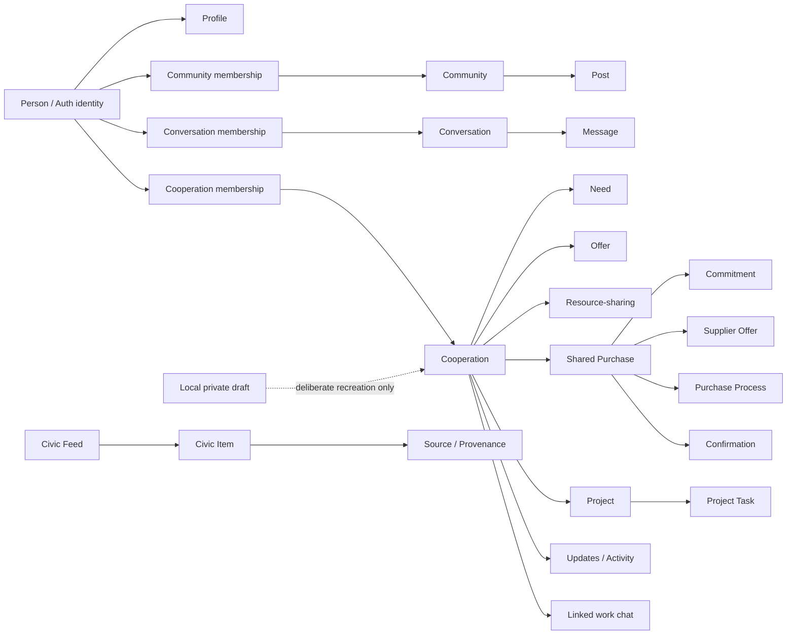

# FOLKOOP Unified Domain Map v1

Date: 4 October 2026.  
Status: **architecture map; current implementation and approved target are explicitly separated**.  
Authority: `FOUNDATION_CHARTER.md` / **FK-FOUNDATION-2026-10-04**.

## Purpose

This map defines one vocabulary for the integrated FOLKOOP without pretending that every target concept already exists in the database. It combines live Supabase verification, current runtime models, the four-origin Foundation Charter, SDCF semantics and the retained Web3/Web4 direction.

The governing rule is: **storage/UI state is not automatically the domain truth of a real-world event**. In particular, `done != confirmed real-world Outcome`.

## Status vocabulary

- `implemented_first_class` — Current first-class operational record.
- `implemented_relation` — Current stored relationship/state between first-class records.
- `implemented_variant` — Current semantic variant of a broader stored record; not a separate table/entity.
- `implemented_runtime_model` — Current runtime/normalized model outside shared relational application storage.
- `implemented_local_only` — Current browser-local/private model that is not silently published.
- `implemented_operational_control` — Current private operational control, not a participant-facing product domain object.
- `illustrative_only` — Authored learning/story data, never operational truth.
- `partial_representation` — Concept exists only as a scalar/variant/slice; target first-class semantics are incomplete.
- `approved_target` — Required/accepted target object or layer with no current first-class implementation.
- `approved_semantic_layer` — Accepted cross-cutting semantic concept; runtime enforcement/mapping incomplete.

## Current operational spine

The shared network currently uses Supabase Auth + PostgreSQL. Live verification on 4 October found **27** FOLKOOP/private application tables. The main current graph is:

Important: Need, Offer, Resource-sharing, Shared Purchase and Project are currently **variants of `public.fk_cooperations`**, not five independent first-class tables.

## Charter target connection map

The Foundation Charter requires the future connected journey:

> Person ↔ Community ↔ Intent ↔ Need/Offer ↔ Skill/Resource ↔ Project/Task ↔ Organisation/Service ↔ City Process ↔ Center/Place/Activity ↔ Agreement/Decision ↔ Economic Coordination ↔ Outcome.

This is a target domain map, not a migration instruction and not a reason to introduce a graph database. PostgreSQL remains operational truth; a future Action Graph is derived from normalized data.

## Domain objects

### identity

| Object | Status | Current representation / storage | Gap or invariant | Requirements |
|---|---|---|---|---|
| `person` — Person / authenticated identity | `implemented_first_class` | auth.users | — | `KP-01`, `ID-02` |

### people

| Object | Status | Current representation / storage | Gap or invariant | Requirements |
|---|---|---|---|---|
| `profile` — Network profile | `implemented_first_class` | public.fk_profiles | — | `KP-01`, `FX-02` |
| `skill` — Skill | `partial_representation` | public.fk_profiles.skills text | Not a first-class Skill record yet. | `FN-08` |

### community

| Object | Status | Current representation / storage | Gap or invariant | Requirements |
|---|---|---|---|---|
| `community` — Community | `implemented_first_class` | public.fk_communities | — | `KP-01`, `GBG-03` |
| `community_membership` — Community membership | `implemented_relation` | public.fk_memberships | — | `KP-01`, `GBG-03` |
| `community_post` — Community post | `implemented_first_class` | public.fk_posts | — | `KP-01`, `GBG-03` |

### messaging

| Object | Status | Current representation / storage | Gap or invariant | Requirements |
|---|---|---|---|---|
| `conversation` — Conversation | `implemented_first_class` | public.fk_conversations | — | `KP-01` |
| `conversation_membership` — Conversation membership | `implemented_relation` | public.fk_conversation_members | — | `KP-01` |
| `conversation_invite` — Conversation invitation | `implemented_relation` | public.fk_conversation_invites | — | `KP-01` |
| `message` — Message | `implemented_first_class` | public.fk_messages | — | `KP-01` |

### cooperation

| Object | Status | Current representation / storage | Gap or invariant | Requirements |
|---|---|---|---|---|
| `cooperation` — Cooperation | `implemented_first_class` | public.fk_cooperations | — | `KP-02`, `ID-02` |
| `cooperation_membership` — Cooperation membership | `implemented_relation` | public.fk_cooperation_members | — | `KP-02` |
| `cooperation_update` — Cooperation update | `implemented_first_class` | public.fk_cooperation_updates | — | `FX-01` |
| `cooperation_activity` — Cooperation activity record | `implemented_first_class` | public.fk_cooperation_activity | — | `FX-01`, `FX-06` |
| `cooperation_read_state` — Cooperation read state | `implemented_relation` | public.fk_cooperation_reads | — | `FX-01` |
| `cooperation_chat_link` — Cooperation ↔ work-chat link | `implemented_relation` | public.fk_cooperation_chats | — | `FX-01` |
| `need` — Need | `implemented_variant` | public.fk_cooperations.kind='need' | — | `KP-02`, `FN-08`, `GBG-05` |
| `offer` — Offer | `implemented_variant` | public.fk_cooperations.kind='offer' | — | `KP-02`, `FN-08`, `GBG-05` |
| `resource_cooperation` — Resource-sharing cooperation | `implemented_variant` | public.fk_cooperations.kind='resource' | This is a cooperation kind, not yet the first-class interoperable Resource object required by W34-14. | `KP-02`, `IN-02` |

### cooperative_economy

| Object | Status | Current representation / storage | Gap or invariant | Requirements |
|---|---|---|---|---|
| `shared_purchase` — Shared Purchase | `implemented_variant` | public.fk_cooperations.kind='purchase' | — | `KP-03`, `KP-04` |
| `purchase_commitment` — Purchase quantity commitment | `implemented_relation` | public.fk_purchase_commitments | — | `KP-03` |
| `supplier_offer` — Supplier coordination offer | `implemented_first_class` | public.fk_purchase_offers | — | `KP-04` |
| `supplier_offer_choice` — Selected supplier offer | `implemented_relation` | public.fk_purchase_offer_choice | — | `KP-04` |
| `purchase_process` — Shared-purchase lifecycle state | `implemented_first_class` | public.fk_purchase_process | — | `KP-04` |
| `purchase_confirmation` — Participant purchase confirmation | `implemented_relation` | public.fk_purchase_confirmations | — | `KP-04` |

### projects

| Object | Status | Current representation / storage | Gap or invariant | Requirements |
|---|---|---|---|---|
| `project` — Project | `implemented_variant` | public.fk_cooperations.kind='project' | — | `FN-09`, `FX-01` |
| `project_task` — Project task | `implemented_first_class` | public.fk_project_tasks | — | `FX-01` |

### safety

| Object | Status | Current representation / storage | Gap or invariant | Requirements |
|---|---|---|---|---|
| `block_relation` — Participant block relation | `implemented_relation` | public.fk_blocks | — | `FX-11` |
| `post_report` — Post moderation report | `implemented_first_class` | public.fk_reports | — | `FX-11` |
| `message_report` — Message moderation report | `implemented_first_class` | public.fk_message_reports | — | `FX-11` |
| `supplier_offer_report` — Supplier-offer moderation report | `implemented_first_class` | public.fk_purchase_offer_reports | — | `KP-04` |

### city

| Object | Status | Current representation / storage | Gap or invariant | Requirements |
|---|---|---|---|---|
| `civic_feed` — Civic feed envelope | `implemented_runtime_model` | docs/DATA_MODEL.md::CivicFeedEnvelope | — | `SV-01`, `SV-04`, `SV-05`, `SV-10`, `FO-04` |
| `civic_item` — Civic item / current City record | `implemented_runtime_model` | docs/DATA_MODEL.md::CivicItem | Not yet a shared relational City Process connected to cooperation objects. | `SV-02`, `SV-03`, `SV-04`, `SV-05`, `SV-10`, `FO-04` |
| `source_provenance` — External-source provenance | `implemented_runtime_model` | sourceId/sourceUrl/fetchedAt/adapterVersion plus source version/time when available | — | `SV-10`, `SDCF-04`, `SDCF-09` |

### local_workspace

| Object | Status | Current representation / storage | Gap or invariant | Requirements |
|---|---|---|---|---|
| `local_private_profile` — Local private profile | `implemented_local_only` | browser-local/memory profile in apps/web/folkoop.js | — | `FX-02`, `IN-05` |
| `local_private_draft` — Local private draft | `implemented_local_only` | browser-local/memory drafts in apps/web/folkoop.js | Never silently uploaded into shared network state. | `FX-02`, `IN-05` |

### pilot_operations

| Object | Status | Current representation / storage | Gap or invariant | Requirements |
|---|---|---|---|---|
| `pilot_admission` — Pilot admission | `implemented_operational_control` | folkoop_private.pilots | — | `FX-11` |
| `pilot_invite` — Pilot invitation slot | `implemented_operational_control` | folkoop_private.pilot_invites | — | `FX-11` |
| `write_budget` — Write-rate budget | `implemented_operational_control` | folkoop_private.write_budgets | — | `FX-11` |

### experience

| Object | Status | Current representation / storage | Gap or invariant | Requirements |
|---|---|---|---|---|
| `mura_illustrative_account` — Mura illustrative account/story layer | `illustrative_only` | authored deterministic fixture and navigation layer | Illustrative data never proves live external services or participant activity. | `FX-04`, `MU-01`, `MU-02`, `MU-04`, `MU-05` |

### target_core

| Object | Status | Current representation / storage | Gap or invariant | Requirements |
|---|---|---|---|---|
| `intent` — Intent | `partial_representation` | Need/Offer/Resource/Project/Purchase cooperation kinds express intent today | No first-class Intent record independent of cooperation kind. | `ID-02`, `FO-01` |
| `resource` — Resource | `approved_target` | — | Current 'resource' is a cooperation kind; interoperable Resource identity/state is not yet implemented. | `KP-02`, `W34-14`, `IN-02` |
| `organisation` — Organisation | `approved_target` | — | — | `FN-05`, `IN-01` |
| `service` — Service / partner capability | `approved_target` | — | — | `FN-03`, `FN-05`, `IN-01` |

### target_city_bridge

| Object | Status | Current representation / storage | Gap or invariant | Requirements |
|---|---|---|---|---|
| `city_process` — City Process | `approved_target` | — | Current CivicItem runtime records are not yet connected first-class processes. | `FO-04`, `IN-01`, `SV-12` |

### target_center

| Object | Status | Current representation / storage | Gap or invariant | Requirements |
|---|---|---|---|---|
| `center` — Center | `partial_representation` | apps/web/folkoop.js: Online Center Göteborg v0 connected route hub | Online Center v0 connects current routes and authored local context; staffed Host/referral, live forum synchronization, first-class Center/Place/Activity records and a physical venue remain unimplemented. | `FN-01`, `FN-03`, `FN-16`, `GBG-01`, `GBG-02`, `IN-04` |
| `place` — Place | `approved_target` | — | — | `FX-07`, `IN-04`, `W34-14` |
| `activity` — Activity / Meetup / Meeting | `approved_target` | — | — | `FN-11`, `FX-07`, `GBG-03` |
| `host` — Host / human navigator | `approved_target` | — | — | `FN-01`, `FN-06`, `FN-10` |
| `referral` — Warm referral + follow-up | `approved_target` | — | — | `FN-06`, `FN-07` |

### target_governance

| Object | Status | Current representation / storage | Gap or invariant | Requirements |
|---|---|---|---|---|
| `agreement` — Agreement / community document | `approved_target` | — | — | `KP-07`, `KP-08`, `BC-01` |
| `decision_record` — Decision | `approved_target` | — | — | `KP-08`, `SDCF-07`, `BC-01` |

### target_economy

| Object | Status | Current representation / storage | Gap or invariant | Requirements |
|---|---|---|---|---|
| `economic_coordination` — Economic Coordination | `partial_representation` | Shared Purchase slice implements demand/offer/order/distribution coordination only | Production, sales, broader logistics/storage/returns and accounting integrations are not one complete first-class model. | `FO-06`, `KP-03`, `KP-04`, `KP-05`, `KP-06`, `IN-02` |

### target_integrity

| Object | Status | Current representation / storage | Gap or invariant | Requirements |
|---|---|---|---|---|
| `outcome` — Outcome | `approved_target` | — | fk_cooperations.status='done' is not a confirmed real-world outcome. | `FX-06`, `SDCF-13` |
| `evidence_artifact` — Evidence artifact / provenance-backed evidence | `partial_representation` | City source provenance exists; general cooperation evidence object does not | — | `FX-06`, `SDCF-09`, `W34-05` |
| `attestation` — Attestation | `approved_target` | — | — | `W34-05`, `BC-02`, `BC-06` |

### target_trust

| Object | Status | Current representation / storage | Gap or invariant | Requirements |
|---|---|---|---|---|
| `passport_credential` — Passport / portable credential | `approved_target` | — | — | `FN-19`, `W34-03`, `W34-04`, `W34-06` |

### target_network

| Object | Status | Current representation / storage | Gap or invariant | Requirements |
|---|---|---|---|---|
| `node` — FOLKOOP Node / partner node | `approved_target` | — | — | `FN-16`, `FX-09`, `W34-07` |
| `action_graph` — Derived Action / Cooperation Graph | `approved_target` | — | Derived from normalized relational truth; no new graph database is required. | `ID-02`, `W34-02` |

### target_agents

| Object | Status | Current representation / storage | Gap or invariant | Requirements |
|---|---|---|---|---|
| `software_agent` — FOLKOOP action agent | `approved_target` | — | No arbitrary SQL/service-role bypass; consequential actions require proportional explicit authorization. | `FX-05`, `W34-09`, `W34-10`, `W34-11`, `W34-12`, `W34-13` |

## SDCF cross-cutting semantics

SDCF is not a competing product taxonomy. It supplies semantic discipline across City, Center, projects, economy, outcomes and future agents.

| Concept | Meaning | Requirement |
|---|---|---|
| `system_scope` — System / SystemScope | scope of a project, community, Center operation, purchase, City process or Place | `SDCF-01` |
| `agent_semantic` — Agent | participant, organisation, Host, operator, authority or software agent | `SDCF-02` |
| `state_property` — State / Property | operational state without implying external truth | `SDCF-02` |
| `objective` — Objective | what the scoped system tries to achieve | `SDCF-03` |
| `criterion` — Criterion | how an objective is evaluated | `SDCF-03` |
| `constraint` — Constraint | law, budget, eligibility, time, capacity, safety, privacy | `SDCF-03` |
| `observation` — Observation | source-bound observation separated from interpretation | `SDCF-04` |
| `model` — Model / Assumption / Uncertainty | purpose/scope/version/validity/provenance | `SDCF-05` |
| `prediction` — Prediction | assumptions, horizon, support state and uncertainty | `SDCF-06` |
| `decision_semantic` — Decision | selected alternative, objective, authority and timestamp | `SDCF-07` |
| `plan` — Plan | traceable plan implementing a decision | `SDCF-08` |
| `controlled_action` — ControlledAction | action traceable to plan/decision/controller | `SDCF-08` |
| `claim_evidence` — Claim / Evidence | support/challenge state; evidence is not flattened into truth | `SDCF-09` |
| `feedback_learning` — Feedback / Learning | learning updates models without rewriting history | `SDCF-10` |

## Explicit non-equivalences

- PostgreSQL/Supabase remains operational truth; the Action Graph is derived.
- Need, Offer, Resource-sharing, Shared Purchase and Project are current cooperation variants, not separate operational databases.
- Local private drafts never become shared network records automatically.
- Mura is illustrative authored data and cannot prove live external services, participants or blockchain transactions.
- Center is not yet an operating first-class object/venue; current UI presentation lags the Charter's online/physical/hybrid target.
- Current Mura routing does not yet expose the Charter-required Center/GBG Forum story; this is an implementation gap.
- Skill is currently profile text, not a first-class skill object.
- Current resource cooperation is not yet the first-class interoperable Resource target.
- CivicItem/source provenance is implemented runtime semantics, but City Process ↔ cooperation/project bridges are not first-class yet.
- done != confirmed real-world Outcome.
- Evidence, attestation, cryptographic integrity and authority decision remain distinct.
- No mandatory wallet/token/NFT/seed phrase is implied by the blockchain/Web3 workstream.
- Formal legal membership is distinct from account, community membership and pilot admission.

## Highest-value architecture gaps

### gap-online-center

Online Center Göteborg v0 now connects self-service routes and authored Göteborg local-community context. Remaining work: staffed Host/referral operations, first-class Center/Place/Activity records and any separately authorized forum integration.

Objects: `center`, `community`, `host`, `referral`, `place`, `activity`.  
Requirements: `GBG-01`, `GBG-02`, `GBG-07`, `GBG-08`, `FN-01`, `IN-04`.

### gap-city-cooperation-bridge

Connect source-first City records/processes to explicit next actions in cooperation/projects while preserving authority/source boundaries.

Objects: `civic_item`, `city_process`, `need`, `project`, `organisation`, `service`.  
Requirements: `IN-01`, `FO-04`, `SV-10`.

### gap-cooperative-economy

Expand the implemented purchase slice to the preserved broader economic cycle: work/production/sales/logistics/returns plus specialist integrations.

Objects: `economic_coordination`, `shared_purchase`, `resource`, `organisation`, `agreement`, `decision_record`.  
Requirements: `FO-06`, `KP-05`, `KP-06`, `KP-08`, `IN-02`.

### gap-outcome-evidence

Introduce separate Outcome/Evidence/Attestation semantics without treating internal completion state as truth.

Objects: `outcome`, `evidence_artifact`, `attestation`.  
Requirements: `FX-06`, `SDCF-09`, `W34-05`, `BC-06`.

### gap-mura-whole-system

Extend Mura from the current story set to the whole-system map, including Center/GBG context and later implemented vertical slices.

Objects: `mura_illustrative_account`, `center`, `civic_item`, `project`, `outcome`.  
Requirements: `MU-01`, `MU-03`, `MU-04`, `MU-05`.

## Current Center/Mura v0 boundary

Online Center Göteborg v0 now provides a connected runtime route between People, Communities, City, Together and Projects, and Mura can open an authored Göteborg-local Center story. This is a **partial representation**, not a first-class Center service: there is no staffed Host/referral operation, no live forum synchronization, no imported forum identities/messages, no first-class Center/Place/Activity records and no physical FOLKOOP venue claimed open.

## Current City boundary

City already has normalized source-first runtime records and provenance. What is missing is the first-class bridge from an authoritative/derived City item or process into a FOLKOOP next action such as a Need, Project, relevant organisation/service or Center/Host referral. That bridge must preserve `source != claim` and must not make FOLKOOP the public authority.

## Current economy boundary

Shared Purchase is a real implemented slice with quantity commitments, supplier coordination offers, selection, confirmation, external-order/delivery/pickup states and completion notes. It is **not** the full cooperative-economy target: production, sales, wider logistics/storage/returns, agreements/decisions and specialist accounting/payment integrations remain separate requirements.

## Outcome boundary

There is no first-class `Outcome` table today. `fk_cooperations.status='done'`, task `done`, purchase `done` or an activity log entry are internal states. A future Outcome must keep participant claim, multi-party confirmation, external evidence, cryptographic integrity and authority decision distinct.

## Verification basis

- live Supabase schema verification: 4 October 2026;
- current `docs/ARCHITECTURE.md`, `docs/DATA_MODEL.md` and runtime code;
- `docs/FOUNDATION_CHARTER.md`;
- `docs/architecture/SDCF_INTEGRATION.md`;
- `docs/architecture/TRUST_IDENTITY_WEB4_ARCHITECTURE.md`;
- `docs/NO_LOSS_REQUIREMENTS_REGISTER.json` for stable requirement IDs.

The machine-readable source for this document is `docs/architecture/unified-domain-map-v1.json`.
